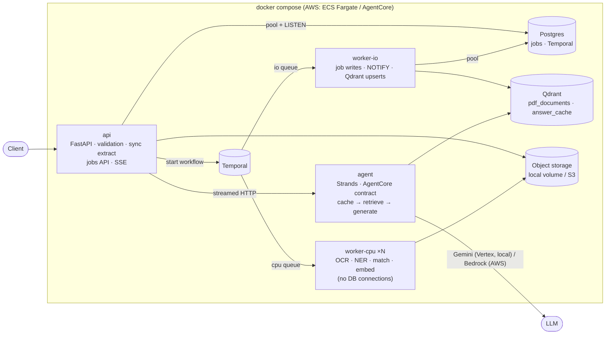
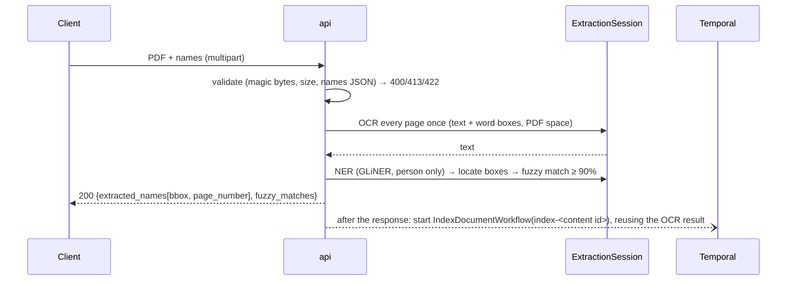
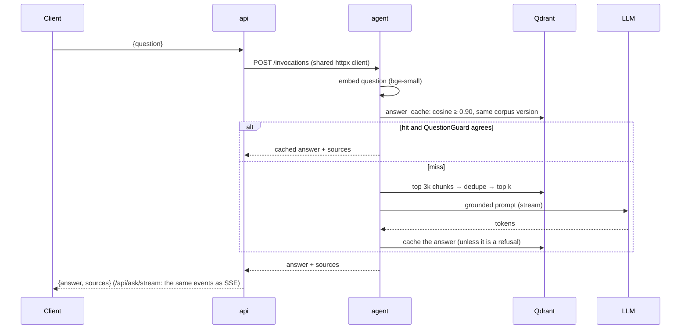

# Design — PDF Name Extractor & RAG API

Detail lives in [ADR 0001](docs/adr/0001-architecture.md), the spikes ([`spikes/`](spikes/)) and
[`infra/`](infra/README.md). This page is the summary.

## 1. Components



Every backend sits behind a Protocol (`OCRService`, `NERService`, `NameLocator`, `NameMatcher`,
`EmbeddingService`, `VectorStore`, `SemanticCache`, `LLMClient`, `JobRepository`, `ObjectStorage`,
`JobOrchestrator`). Factories
build the configured implementation. Models and clients are created once per process: in the
FastAPI lifespan or at worker startup. Routes receive them through `Depends`, and tests replace
them with `dependency_overrides`.

## 2. Sequences

**`POST /api/extract` (synchronous; the contract the provided tests fix)**



**`POST /api/ask` (answer streamed through the API from the agent)**



Large or batch work goes through **`POST /api/jobs` → 202**. The API stores the PDF, inserts the
job row and starts `ExtractNamesWorkflow`:

```
mark_running(io) → prepare(cpu) → ocr_page × N in parallel(cpu) → extract_and_match(cpu) → complete_job(io, NOTIFY)
child: IndexDocumentWorkflow → chunk_and_embed(cpu) → upsert_chunks(io)
```

`GET /api/jobs/{id}/events` pushes the result over SSE when the `NOTIFY` arrives. Activities pass
storage keys, never document contents.

## 3. Technology choices (each measured in a spike before it was adopted)

| Concern | Choice | Evidence / trade-off |
|---|---|---|
| OCR | PaddleOCR PP-OCRv5 mobile on ONNX Runtime (RapidOCR) | CER 2.4% vs Tesseract 14.9%, name recall 88% vs 76%. p99 519 ms/page, cold start 0.8 s. Native Paddle was 8× slower; Docling has no word boxes. Tesseract is the `fallback` extra. |
| NER | GLiNER small v2.1, ONNX int8, threshold 0.3 | F1 0.94 on real OCR output, **0 false positives** vs 178 for the original spaCy `sm`; 32 ms/page, 175 MB. The threshold is tuned on our dataset and is configurable; re-validate on new document types. |
| Embeddings | bge-small-en-v1.5 via fastembed (ONNX) | Recall@3 1.00, MRR 0.92, 2.4 ms/query, 384 dims. No model handled hard negatives well, so the cache guard and the LLM compensate. |
| Answer cache | Qdrant, cosine ≥ 0.90 **and** QuestionGuard | No threshold alone is safe (role swaps score 0.99). With the guard: 0 false hits, 94% of repeated questions hit. Refusals are never cached, and entries are scoped to the corpus version. |
| Orchestration | Temporal, separate `cpu` / `io` queues | Durable retries, per-page fan-out, heartbeats. CPU workers scale without adding DB connections. |
| Data | Postgres (psycopg pools, LISTEN/NOTIFY), Qdrant | One relational engine for jobs and Temporal; the vector store the tests target. |
| Agent | Strands on the AgentCore contract | Gemini on Vertex via read-only ADC locally (opt-in); Bedrock on AgentCore in AWS. With no credentials it answers with the closest retrieved sentence, so `docker compose up` works anywhere. |
| Packaging | uv extras `chosen` / `fallback`; models baked into images | Reproducible, offline start; `STACK` build arg. |

**Trade-offs accepted:** more moving parts than one FastAPI process. The synchronous endpoint is
still there for the simple path. Answers are streamed straight through, not via a broker, so a
dropped stream can't resume. Documents are chunked by fixed size, not by section.

## 4. Scaling to 1,000+ PDFs/hour

- **Load:** 1,000 PDFs/h × ~3 pages ≈ 0.8 pages/s. OCR costs ~3.3 core-seconds per page (spike 01);
  NER and embedding add < 5%. That is **~3 busy cores on average**. Size for 3× peaks: about
  **5 CPU workers × 2 vCPU**, scaled on Temporal `cpu` queue backlog (ECS target tracking).
  Before going live, cap ONNX intra-op threads per worker (not configured yet) so pages run side
  by side without fighting for cores.
- **Entry point:** batches go through `/api/jobs`. Temporal absorbs bursts in its queues, and the
  API only stores the file and starts a workflow. Multi-page PDFs OCR their pages in parallel.
- **Connections don't grow with workers:** only `api` and `io` hold Postgres pools, so DB
  connections ≈ api replicas × pool + io pool, regardless of CPU worker count. PgBouncer is the
  next step if API replicas multiply.
- **Duplicate work:** document IDs come from the file's content, so a re-submitted PDF is indexed once.
- **Production write path** (in `infra/`): transactional outbox → Debezium → Kinesis → Lambda
  starts the workflow. S3 for storage, RDS, Fargate services, AgentCore for the agent.

## 5. Failure modes and mitigations

| Failure | Mitigation |
|---|---|
| Invalid, oversized or too-long PDF | Rejected at the edge (400/413/422). In workflows, `InvalidDocument` is non-retryable: the job fails fast with a reason. |
| Worker crash mid-OCR | Temporal retries the activity with backoff; heartbeats detect stalled pages; finished pages are kept. |
| Temporal down when a job is submitted | The job row stays `queued`; the reconciler schedule restarts stale jobs. The fixed workflow ID makes restarts idempotent. (The outbox removes this gap in production.) |
| Indexing fails | Child workflow / background task: logged, never fails extraction or the HTTP response. |
| Postgres saturated | Bounded pools with acquire timeouts and `max_waiting` → fast 503 + `Retry-After`; statement timeout. |
| Qdrant, agent or LLM slow or down | Client timeouts; the API returns 503 + `Retry-After`, not a hang. A failure mid-stream currently just closes the stream (follow-up: emit an `error` event). |
| Wrong cached answer | QuestionGuard (negation, numbers, entities, order); refusals not cached; entries invalidated when the corpus changes. |
| LLM hallucination | Retrieve-then-generate with a strict grounded prompt and an explicit refusal; sources returned with every answer. |
| Model download or drift at runtime | Models baked into images, `HF_HUB_OFFLINE=1`; contract tests run every engine against the same expectations. |
| Secrets | ADC mounted read-only, never baked into images; detect-secrets in pre-commit; least-privilege IAM (CrossGuard policy). |

## 6. LLM routing strategy (proposed)

A `ModelRouter` in the agent picks a tier per question, behind the same provider abstraction.

1. **Cheap signals first (no model call):** question length, number of entities and clauses,
   words like *compare / why / summarise / across*, and the retrieval score spread (a flat
   spread means the answer is spread over several passages).
2. **Tiers:** *fast* (Gemini Flash / Claude Haiku) for single-fact lookups, which is most traffic;
   *strong* (Gemini Pro / Claude Sonnet) for multi-hop, comparison or summary questions;
   *agentic*, where retrieval becomes a Strands tool for iterative search, for questions the
   strong tier refuses although relevant passages were found (e.g. "main findings" over a long report).
3. **Escalation:** if the fast tier refuses or gives low-confidence output despite strong
   retrieval, retry one tier up. Cache answers per tier, and record tier, latency, tokens and
   escalations to tune thresholds.
4. **Guardrails:** cost ceiling per request; fall back to the fast tier when the strong one is
   throttled; the router is configuration-driven so tiers map to Gemini locally and Bedrock in AWS.

**Follow-ups:** section-aware chunking; a reranker for near-duplicate passages; GLiNER on raw
onnxruntime to drop torch (~650 MB); app-side S3 storage, DB URL from parts, an AgentCore client,
and the outbox write mode for the AWS deployment.
