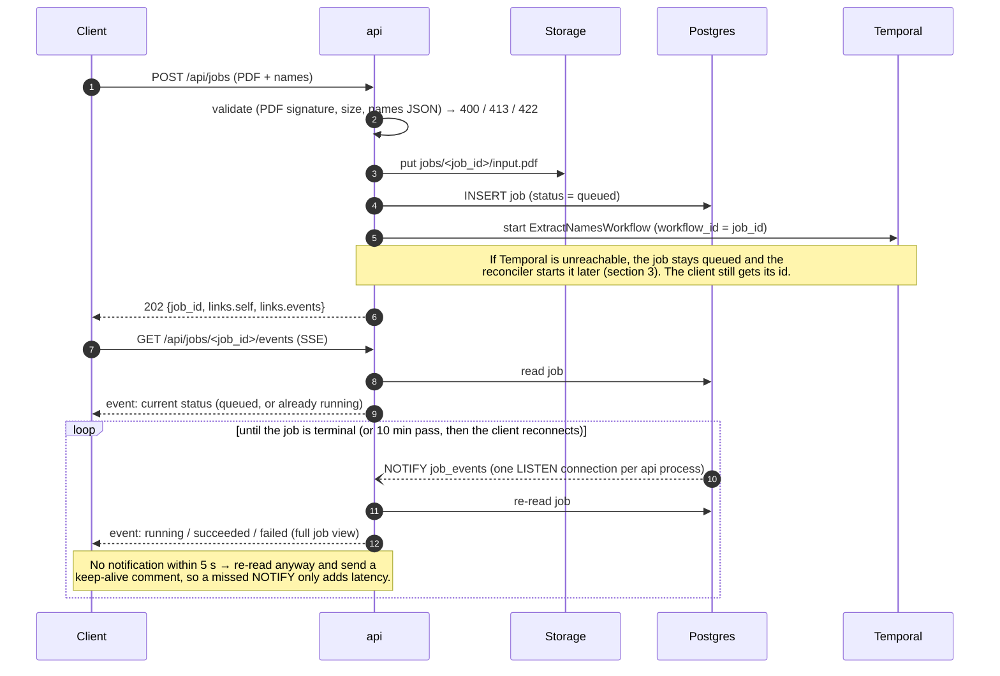
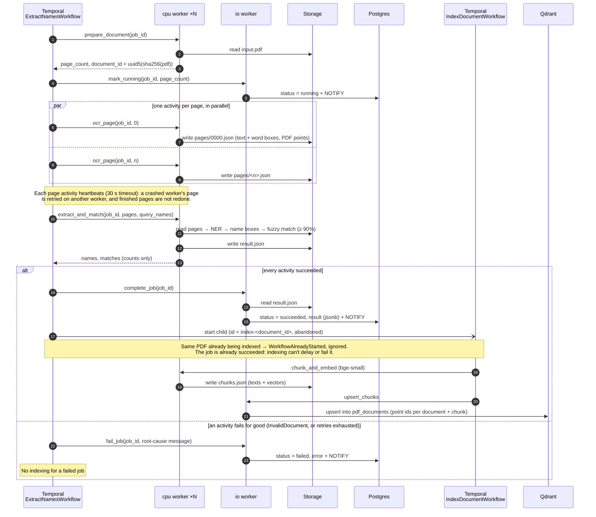
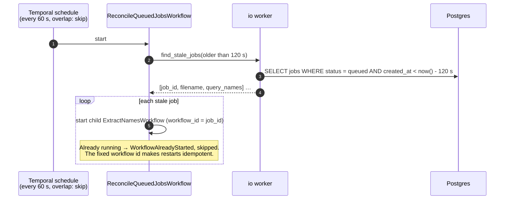
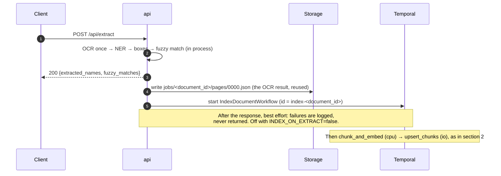

# Async jobs — sequence diagrams

How large and batch PDFs are processed: `POST /api/jobs` returns `202` immediately, and a
Temporal workflow runs the same extraction as `/api/extract`, split across worker queues.
This is the path the scaling plan in [DESIGN.md](../DESIGN.md#4-scaling-to-1000-pdfshour)
relies on. Everything below is implemented and runs in `docker compose`.

The production write path (transactional outbox → Debezium → Kinesis → Lambda) is designed
in [ADR 0001](adr/0001-architecture.md) and modelled in `infra/`, but not built, so it isn't
diagrammed here.

**Participants**
- **api**: FastAPI. Validates the upload, records the job, starts the workflow, serves SSE.
- **Storage**: the PDF and intermediate artifacts (a local volume; S3 in AWS). Activities
  pass storage keys, never document contents.
- **Postgres**: the `jobs` table. Every status change sends `NOTIFY job_events` in the same
  transaction.
- **Temporal**: runs the workflows and dispatches activities to two task queues.
- **cpu worker** (`extraction-cpu`, scales horizontally): OCR, NER, matching, embedding.
  Holds no database connections.
- **io worker** (`extraction-io`): the only worker with a Postgres pool; also writes to Qdrant.

## 1. Submit a job and follow it

`GET /api/jobs/<job_id>` returns the same job view as a one-off JSON read.

## 2. The workflow: extraction across the two queues

**Timeouts and retries** (`app/workflows/workflows.py`)

| Activity | Queue | Start-to-close | Retries |
|---|---|---|---|
| `prepare_document` | cpu | 60 s | up to 3, backoff 1 s → 30 s; invalid input not retried |
| `ocr_page` × N | cpu | 3 min, heartbeat 30 s | up to 3 |
| `extract_and_match` | cpu | 2 min | up to 3 |
| `chunk_and_embed` | cpu | 5 min | up to 3 |
| `mark_running`, `complete_job`, `fail_job` | io | 15 s | up to 10, backoff 1 s → 20 s |
| `upsert_chunks` | io | 60 s | up to 10 |

`prepare_document` fails fast on an unreadable PDF, a PDF with no pages, or more pages than
`MAX_PAGES`: those raise `InvalidDocument`, which is never retried. Indexing runs as an
abandoned child workflow, so the client sees `succeeded` as soon as `complete_job` commits.

## 3. Reconciler: jobs whose workflow never started

The io worker creates this schedule at startup. Its interval and the staleness threshold are
the `RECONCILE_INTERVAL_S` and `RECONCILE_STALE_AFTER_S` settings.

## 4. Background indexing from the sync endpoint

`POST /api/extract` runs extraction in the api process (see DESIGN.md), then reuses the same
indexing workflow, so a document extracted there can be queried with `/api/ask`:

